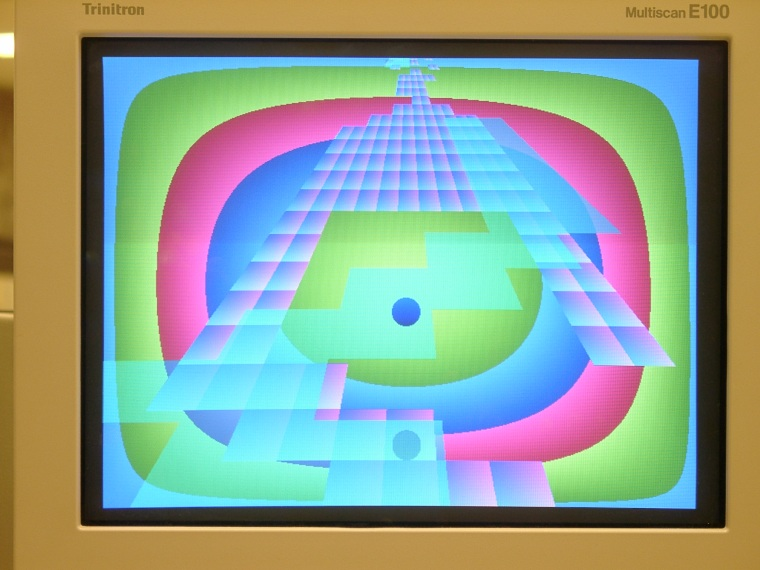

Balkentrol
==========
Lords of Acid
-------------

Balkentrol is a simple 3d racing game implemented entirely in
hardware (no processor or computer of any sort).

It consists of a ball bouncing along a race track. The track
consists of levels at two heights. The lower level is texture
mapped. The second level is transparent. In addition, the game has two
animated backgrounds, and portions of the lower level move. The player
can accelerate in the four directions, and jump. The player can
"boost" before a jump to jump higher. In addition, I implement a very
simple lighting model, where the track darkens towards the back, and
the ball has a shadow. For added headache value, I also support LCD
shutter glasses for a more 3d effect. All of the above are implemented
in the simplest/crudest way I was aware of. The ball cannot turn on
the race track (primarily due to number of gate limitations); just
accelerate in the four directions and jump. The textures have no
interpolation. The systems has no antialiasing. The system runs at VGA
resolution (640x480x24bppx60fps)

The game is hippie/acid-themed, although (to the best of my
knowledge) no one involved in it has, at any point, used illegal
drugs. This is primarily because colors generated through bit
manipulations tend to look very fluorescent, so it was an easy default
theme. I wanted a consistent theme, so I ran with it.

Hardware used
-------------

* Altera 10K20 board, and when I could borrow one, 10K70 FPGA board
* 3x Intersil CA3338 video speed DAC
* 74ls04 inverter
* 25.175 MHz clock chip
* Regulators, capacitors, op-amps, inductors, resistors, etc. 
* A bunch of breadboards (of the solder type; not protoboards)
* A bunch of connectors, wire and cable
* Cheap pair of LCD shutter glasses ($23.75)
* Cheap PC game pad ($3)
* 7.5V 1A power supply

Thanks to a generous anonymous donor for donating a UP1 10k20 board,
which I used to develop the initial version, before I was loaned a
larger 10k70 board (which I had to return; I am investigating
possibilities for acquiring one permanently, but pending that, only
the smaller 10k20 version of the game is functional). Also, thanks to
Intersil for donating the high-speed DAC chips, and assorted MIT
supply rooms for donating the remaining parts.

The game was a group project, although the portions of the project
were entirely modular, and as such, we met maybe three times for about
an hour each before final integration (at which point, my code and
circuitry were fully finished, and required no changes). I was
responsible for the 3d render engine and game play (including
everything on this web page, except for portions of the lab
report). My partner, Kristin Carr, developed a sound system (where the
music changed along with the game play in fairly sophisticated ways,
with multiple tracks of sound, filters, etc.). The two interfaced
through a one-bit connection following the standards of a parallel
interface. In addition, there was an original sound score composed by
Daniel Roy. Only the portions of the project I developed are
documented on this web page (outside of this paragraph).

Although I began developing this project independently of coursework
(primarily to learn more about digital design), I started working on
it the semester I was taking MIT's digital systems lab, and around the
time of the final project (shortly after I had finished the last
laboratory). As a result, I decided to use it for the final project as
well. It was nominated for top laboratory project at MIT, although, as
of this writing, it remains to be seen whether it will win.

Resources
---------

* Source code for final 10k70 version is in the `src/10k70` directory.
* Source code for the preliminary 10k20 version (very partial feature
set) is in the `10k20` directory. This compiles to Altera UP1 student
board. The compiler must set to maximum level of optimization for
speed (rather than space) for glitch-free operation. This does rely on
external video DAC.
* Source code for older 10k20 version, which still used the on-board
VGA port (which only supports 8 color graphics) is in the
`src/10k20-onboard` directory. It still requires 5 external pins to be
connected to buttons to control the ball, but otherwise, it only
requires the basic Altera UP1 board (extremely limited feature set
relative to the full game).
* The writeup for the lab was written late at night, and so may
contain errors. The grammar certainly does, and there's an extra l in
the spelling of the game name on the title page. It is in the
`balken-writeup.pdf` file
* There is a `screenshots` directory too, giving photos of the game in
different modes of operation, and what the overall project looked
like, including 3d glasses.

If you are trying to reimplement this, interfacing to the 10k70
FPGA is easy; the hardware around it must supply 8 input pins; 4 from
arrow controls, 4 for buttons. One is active-low, the other
active-high. The output has 2 pins for the 3d glasses (optional; the
game has non-glass mode as well), which switch every other frame. It
has 24 pins, in sets of 8 each, corresponding to the color output. It
has two others, corresponding to hsync and vsync (I believe the
outputs are inverted). There was a DAC clock pin in the .acf file, but
it is not used. For details, see the laboratory writeup above. 

The 10k20 runs on the UP1 board. It has the same inputs as the
10k70, the same video DAC output, but lacks the stereoscopic glass
output. It has significantly inferior graphics, and much less
functionality (no boost, no transparency, no second level, no shadow,
no stereoscopic glases, no screenshot mode, no communications port to
broadcast game status to other boards, and so on). I have several
screenshots of the 10k20 version.

Bear in mind that the 10k20 version does not have a
stop-frame/screenshot mode, and as a result, there is a significant
amount of blur from the background rotating. The camera shutter time
was set to as short as possible to minimize the effects, but this made
the images very dim, and they had to be brightened in xv to reflext
the actual game. As a result, they look fairly blurry, and the colors
are a bit off.

Copyright (c) 2003. Piotr F. Mitros. 
